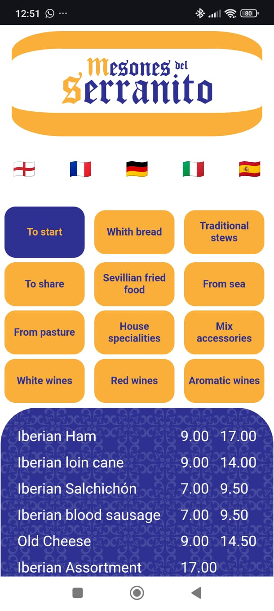

# 📱 MenuIdiomas

## **¡Bienvenido a _MenuIdiomas_!**

##  Este proyecto es una aplicación desarrollada con **Vue 3** y **Vite** para mostrar menús de restaurante en varios idiomas de forma sencilla y elegante.

 

---

## 🚀 Características

- 🌍 Menús multilingües (Español, Alemán, etc.)
- 🍽️ Navegación intuitiva entre categorías (Refrescos, Cafés, Cervezas, Vinos, Licores...)
- 💡 Interfaz moderna y responsive
- ⚡️ Desarrollado con Vue 3 + Vite para máxima velocidad

---
